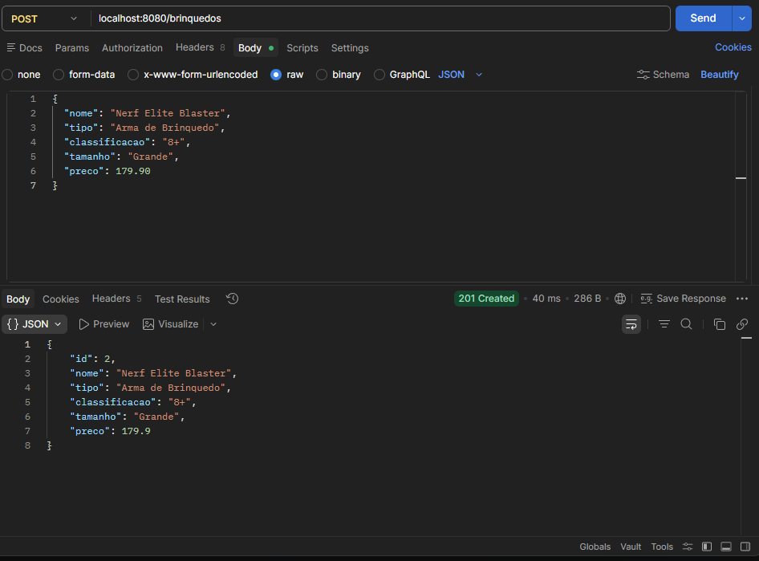
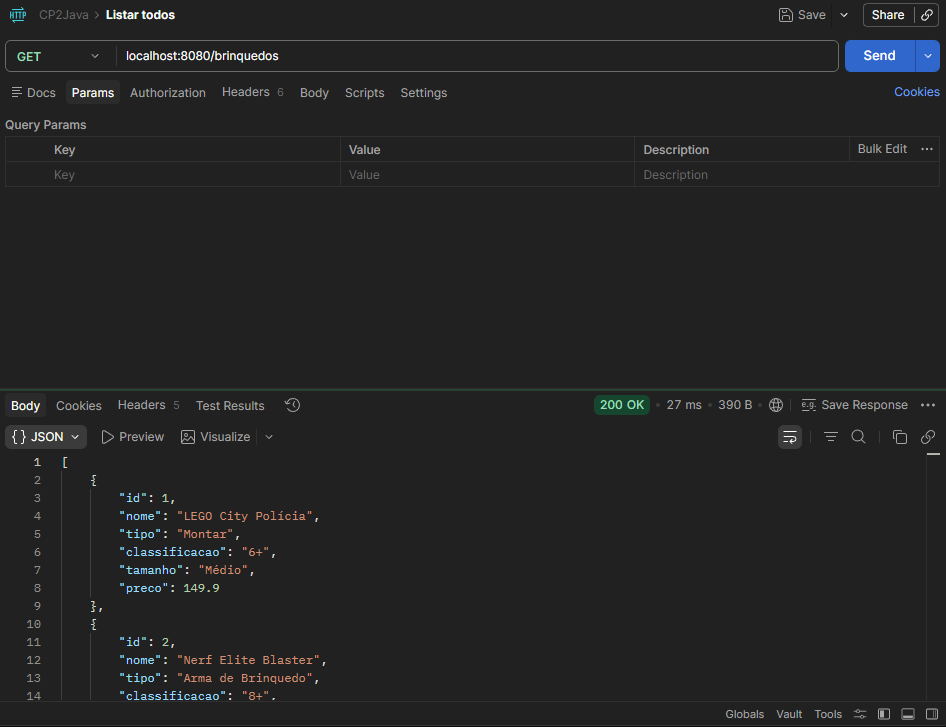
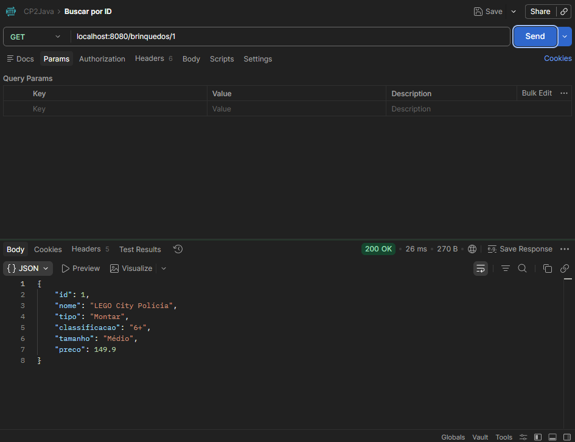
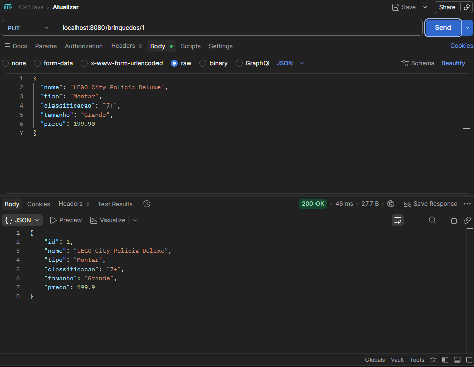
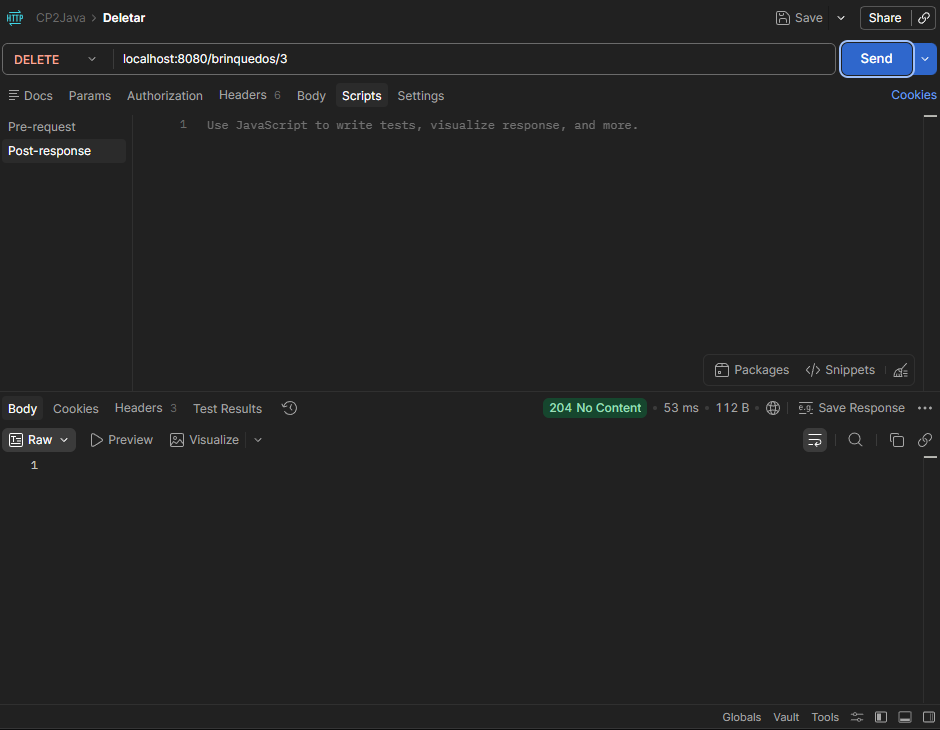
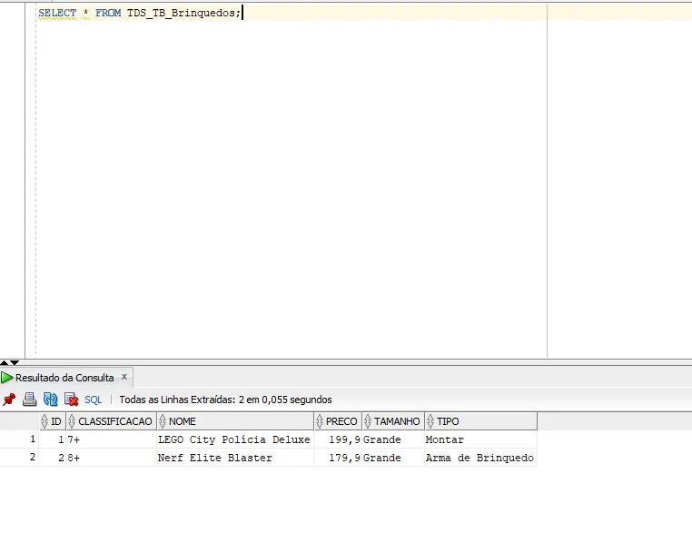

# CP2 – API de Brinquedos 

---

## Descrição
API REST para gerenciar brinquedos de crianças até 14 anos.  
Desenvolvida com Spring Boot + JPA + Oracle, rodando na porta 8080.

---

## Tecnologias
- Java 21 | Spring Boot 4.0.6 | Maven
- Spring Web, Spring Data JPA, Validation, Lombok
- Oracle JDBC | Tomcat (porta 8080)

---

## Configuração do Spring Initializr


---

## Como rodar
1. Abra a pasta `brinquedos` no IntelliJ
2. Edite `application.properties` com seu RM e senha Oracle
3. Execute `BrinquedosApplication.java`
4. Acesse `http://localhost:8080/brinquedos` no Postman

---

## Endpoints

| Método | URL | Descrição |
|---|---|---|
| GET | `/brinquedos` | Lista todos |
| GET | `/brinquedos/{id}` | Busca por ID |
| POST | `/brinquedos` | Cria novo |
| PUT | `/brinquedos/{id}` | Atualiza |
| DELETE | `/brinquedos/{id}` | Remove |

---

## Testes no Postman

---

### POST – Criar brinquedo
**URL:** `http://localhost:8080/brinquedos` | **Método:** POST  

```json
{
  "nome": "LEGO Batman",
  "tipo": "Montar",
  "classificacao": "6+",
  "tamanho": "Médio",
  "preco": 149.90
}
```

```json
{
  "nome": "Barbie Fashionista",
  "tipo": "Boneca",
  "classificacao": "3+",
  "tamanho": "Pequeno",
  "preco": 89.99
}
```

```json
{
  "nome": "Hot Wheels Pista Radical",
  "tipo": "Veículo",
  "classificacao": "5+",
  "tamanho": "Grande",
  "preco": 249.90
}
```

```json
{
  "nome": "Quebra-Cabeça 500 Peças",
  "tipo": "Educativo",
  "classificacao": "10+",
  "tamanho": "Médio",
  "preco": 59.90
}
```

**Resposta (HTTP 201 Created):**



---

### GET – Listar todos
**URL:** `http://localhost:8080/brinquedos` | **Método:** GET

**Resposta (HTTP 200 OK):**



---

### GET – Buscar por ID
**URL:** `http://localhost:8080/brinquedos/1` | **Método:** GET

**Resposta (HTTP 200 OK):**



---

### PUT – Atualizar brinquedo
**URL:** `http://localhost:8080/brinquedos/1` | **Método:** PUT  
**Body → raw → JSON**

```json
{
  "nome": "LEGO Batman Deluxe",
  "tipo": "Montar",
  "classificacao": "7+",
  "tamanho": "Grande",
  "preco": 199.90
}
```

**Resposta (HTTP 200 OK):**



---

### DELETE – Remover por ID
**URL:** `http://localhost:8080/brinquedos/3` | **Método:** DELETE

**Resposta (HTTP 204 No Content):**



---

## Oracle SQL Developer

Após as operações, os dados ficam persistidos na tabela `TDS_TB_Brinquedos`:

```sql
SELECT * FROM TDS_TB_Brinquedos;
```



---

